# 🤖 LLM-TradeBot

[](README.md) [](README_CN.md)


基于 **对抗式决策框架 (Adversarial Decision Framework)** 的智能多 Agent 量化交易机器人。通过市场状态检测、价格位置感知、动态评分校准及多层物理审计，实现高胜率、低回撤的自动化合约交易。

[](https://www.python.org/)
[](LICENSE)
[](https://github.com/EthanAlgoX/LLM-TradeBot)

---

## 🌐 网页在线版 (优先推荐)

**无需部署，直接通过网页端监控和管理您的机器人：**
**[👉 立即访问在线仪表盘](https://llm-tradebot.up.railway.app/)**

---

## ✨ 核心特性

- 🕵️ **感知优先**: 不同于常规指标派，系统优先判断“当前能不能打”，再判断“怎么打”。
- 🤖 **Multi-Agent 协作**: 4 个高度专业化的 Agent 独立运行，形成对抗验证链条。
- ⚡ **异步并发**: 并发获取多周期数据，确保 5m/15m/1h 的数据在同一快照瞬间对齐。
- 🛡️ **安全至上**: 止损方向修正、资金预演、一票否决机制，为实盘交易保驾护航。
- 📊 **全链路审计**: 每一个决策背后的对抗过程、信心惩罚细节均完整记录，实现真正的“白盒化”决策。

---

## 🤝 支持的生态系统

### 支持的交易所

#### CEX (中心化交易所)

| 交易所 | 状态 | 注册 (手续费优惠) |
|----------|--------|-------------------------|
| **Binance** | ✅ 已支持 | [注册账号](https://www.binance.com/join?ref=NOFXENG) |
| **Bybit** | 🗓️ 计划中 | [注册账号](https://partner.bybit.com/b/83856) |
| **OKX** | 🗓️ 计划中 | [注册账号](https://www.okx.com/join/1865360) |
| **Bitget** | 🗓️ 计划中 | [注册账号](https://www.bitget.com/referral/register?from=referral&clacCode=c8a43172) |

#### Perp-DEX (去中心化合约交易所)

| 交易所 | 状态 | 注册 (手续费优惠) |
|----------|--------|-------------------------|
| **Hyperliquid** | 🗓️ 计划中 | [注册账号](https://app.hyperliquid.xyz/join/AITRADING) |
| **Aster DEX** | 🗓️ 计划中 | [注册账号](https://www.asterdex.com/en/referral/fdfc0e) |
| **Lighter** | 🗓️ 计划中 | [注册账号](https://app.lighter.xyz/?referral=68151432) |

### 支持的 AI 模型

| AI 模型 | 状态 | 获取 API Key |
|----------|--------|-------------|
| **DeepSeek** | ✅ 已支持 | [获取 API Key](https://platform.deepseek.com) |
| **Qwen** | ✅ 已支持 | [获取 API Key](https://dashscope.console.aliyun.com) |
| **OpenAI (GPT)** | ✅ 已支持 | [获取 API Key](https://platform.openai.com) |
| **Claude** | ✅ 已支持 | [获取 API Key](https://console.anthropic.com) |
| **Gemini** | ✅ 已支持 | [获取 API Key](https://aistudio.google.com) |
| **Grok** | 🗓️ 计划中 | [获取 API Key](https://console.x.ai) |
| **Kimi** | 🗓️ 计划中 | [获取 API Key](https://platform.moonshot.cn) |

---

## 🚀 快速开始

### 启动流程


### 详细步骤

#### 1. 安装依赖

```bash
pip install -r requirements.txt
```

#### 2. 配置环境

```bash
# 复制环境变量模板
cp .env.example .env

# 设置 API 密钥
./set_api_keys.sh
```

#### 3. 配置交易参数

```bash
# 复制配置文件模板
cp config.example.yaml config.yaml
```

编辑 `config.yaml` 设置交易参数：

- 交易对 (symbol)
- 最大仓位 (max_position_size)
- 杠杆倍数 (leverage)
- 止损止盈比例 (stop_loss_pct, take_profit_pct)

#### 4. 启动 Web 仪表盘 (推荐)


本项目内置现代化的实时监控仪表盘 (Web Dashboard)。

```bash
# 启动主程序 (自动开启 Web 服务)
python main.py --mode continuous
```

启动后,请在浏览器访问: **<http://localhost:8000>** (或使用我们的 [云端在线版](https://llm-tradebot.up.railway.app/))

> **默认密码**: `admin`

**仪表盘功能**:

- **📉 实时 K 线**: 集成 TradingView 组件，1分钟级实时刷新
- **📈 净值曲线**: 实时账户权益变化追踪
- **📋 决策审计**: 完整的历史决策记录，包含 Agents 详细评分 (Strategist, Trend, Oscillator, Sentiment)
- **📜 交易历史**: 所有交易记录及盈亏统计
- **📡 Live Log Output**: 实时滚动日志，支持 Agent 标签高亮显示 (Oracle, Strategist, Critic, Guardian)，500行容量历史回溯

---

## 📁 项目结构

### 目录树形图


### 目录说明

```text
LLM-TradeBot/
├── src/                    # 核心源代码
│   ├── agents/            # 多 Agent 定义 (DataSync, Quant, Decision, Risk)
│   ├── api/               # Binance API 客户端
│   ├── data/              # 数据处理模块 (processor, validator)
│   ├── execution/         # 交易执行引擎
│   ├── features/          # 特征工程模块
│   ├── monitoring/        # 监控和日志
│   ├── risk/              # 风险管理
│   ├── strategy/          # LLM 决策引擎
│   └── utils/             # 工具函数 (DataSaver, TradeLogger 等)
│
├── docs/                  # 项目文档
│   ├── data_flow_analysis.md          # 数据流转分析文档
│   └── *.png                          # 架构图和流程图
│
├── data/                  # 结构化数据存储 (按日期归档)
│   ├── market_data/       # 原始 K 线数据
│   ├── indicators/        # 技术指标
│   ├── features/          # 特征快照
│   ├── decisions/         # 决策结果
│   └── execution/         # 执行记录
│
├── logs/                  # 系统运行日志
├── tests/                 # 单元测试
├── config/                # 配置文件
│
├── main.py                # 统一程序入口 (Multi-Agent 循环)
├── config.yaml            # 交易参数配置
├── .env                   # API 密钥配置
└── requirements.txt       # Python 依赖
```

---

## 🎯 核心架构

### 12-Agent 协作框架 + 四层策略过滤

本系统采用 **四层策略过滤 (Four-Layer Strategy)** 架构，结合 12 个专业化 Agent 协作完成交易决策：

#### 数据层 Agents

| Agent | 角色 | 职责 |
|-------|------|------|
| **🕵️ DataSyncAgent** | The Oracle | 异步并发采集 5m/15m/1h K线数据，确保市场快照一致性 |
| **👨‍🔬 QuantAnalystAgent** | The Strategist | 生成趋势评分、震荡指标、情绪分析及 OI Fuel |

#### 预测层 Agents

| Agent | 角色 | 职责 |
|-------|------|------|
| **🔮 PredictAgent** | The Prophet | 基于技术特征预测价格上涨概率 (Rule-based/ML) |
| **🎯 RegimeDetector** | Regime Analyzer | 检测市场状态 (趋势/震荡) 及 ADX 强度 |
| **🤖 AIFilter** | AI Validator | AI 预测与趋势方向一致性验证，拥有否决权 |

#### 语义分析层 Agents (LLM 上下文生成)

| Agent | 角色 | 职责 |
|-------|------|------|
| **📈 TrendAgent** | Trend Summarizer | 生成趋势方向语义分析 (UPTREND/DOWNTREND) |
| **📊 SetupAgent** | Setup Analyzer | 生成入场位置语义分析 (PULLBACK_ZONE/OVERBOUGHT) |
| **⚡ TriggerAgent** | Trigger Reporter | 生成触发信号语义分析 (CONFIRMED/WAITING) |

#### 决策与执行层 Agents

| Agent | 角色 | 职责 |
|-------|------|------|
| **🧠 StrategyEngine** | LLM Decision | DeepSeek LLM 多空辩论决策引擎 |
| **👮 RiskAuditAgent** | The Guardian | 风控审计，拥有一票否决权 |
| **🧠 ReflectionAgent** | The Philosopher | 交易反思，为 LLM 提供历史教训 |
| **🚀 ExecutionEngine** | The Executor | 精准执行订单及状态管理 |

### 四层策略过滤 (Four-Layer Strategy)

```text
Layer 1: Trend + Fuel (1h EMA + Volume Proxy)
    ↓ PASS/FAIL
Layer 2: AI Filter (PredictAgent 方向一致性验证)
    ↓ PASS/VETO
Layer 3: Setup (15m KDJ + Bollinger Bands 入场位置)
    ↓ READY/WAIT
Layer 4: Trigger (5m 形态 + RVOL 放量确认)
    ↓ CONFIRMED/WAITING
    ↓
🧠 LLM Decision (DeepSeek 多空辩论)
    ↓
👮 Risk Audit (一票否决)
    ↓
🚀 Execution
```

### 数据流转架构


**架构说明**:

1. **数据采集层** (蓝色): DataSyncAgent 异步并发采集多周期数据
2. **量化分析层** (绿色): QuantAnalystAgent 内部 3 个子 Agent 并行分析
3. **决策对抗层** (橙色): DecisionCoreAgent 集成市场感知模块进行加权投票
4. **风控审计层** (红色): RiskAuditAgent 执行最终审核和自动修正
5. **执行层** (紫色): ExecutionEngine 执行订单
6. **可视化层**: Recent Decisions 表格完整展示所有 Agent 数据 (16列)

#### 详细流程图

```mermaid
graph TB
    subgraph "1️⃣ 数据采集层"
        A[🕵️ DataSyncAgent] --> MS[MarketSnapshot<br/>5m/15m/1h + 外部数据]
    end
    
    subgraph "2️⃣ 量化分析层"
        MS --> QA[👨‍🔬 QuantAnalystAgent]
        QA --> TS[TrendSubAgent<br/>1h-T, 15m-T, 5m-T]
        QA --> OS[OscillatorSubAgent<br/>1h-O, 15m-O, 5m-O]
        QA --> SS[SentimentSubAgent<br/>Sentiment]
        TS & OS & SS --> QR[quant_analysis]
    end
    
    subgraph "3️⃣ 决策对抗层"
        QR --> DC[⚖️ DecisionCoreAgent<br/>加权投票]
        DC --> RD[RegimeDetector<br/>市场状态]
        DC --> PA[PositionAnalyzer<br/>价格位置%]
        RD & PA --> VR[VoteResult<br/>Action, Conf, Reason, Aligned]
    end
    
    subgraph "4️⃣ 风控审计层"
        VR --> RA[🛡️ RiskAuditAgent<br/>一票否决]
        RA --> AR[AuditResult<br/>Risk, Guard, Corrections]
    end
    
    subgraph "5️⃣ 执行层"
        AR --> EE[🚀 ExecutionEngine]
    end
    
    subgraph "6️⃣ 可视化层"
        VR & AR --> DT[📊 Recent Decisions<br/>16 Columns]
    end
    
    style A fill:#4A90E2,color:#fff
    style QA fill:#7ED321,color:#fff
    style DC fill:#F5A623,color:#fff
    style RA fill:#D0021B,color:#fff
    style EE fill:#BD10E0,color:#fff
    style DT fill:#50E3C2,color:#000
```



> 📖 **详细文档**: 查看 [数据流转分析文档](./docs/data_flow_analysis.md) 了解完整的数据流转机制，或查看 [多Agent技术详解](./README_MULTI_AGENT.md) 了解底层实现细节。

---

## 📄 数据全链路审计

### 数据存储结构


### 存储组织

系统自动将每一循环的中间过程记录在 `data/` 目录下，按日期组织，方便复盘和调试：

```text
data/
├── market_data/           # 原始多周期 K 线
│   └── {date}/
│       ├── BTCUSDT_5m_{timestamp}.json
│       ├── BTCUSDT_5m_{timestamp}.csv
│       ├── BTCUSDT_5m_{timestamp}.parquet
│       ├── BTCUSDT_15m_{timestamp}.json
│       └── BTCUSDT_1h_{timestamp}.json
│
├── indicators/            # 全量技术指标 DataFrames
│   └── {date}/
│       ├── BTCUSDT_5m_{snapshot_id}.parquet
│       ├── BTCUSDT_15m_{snapshot_id}.parquet
│       └── BTCUSDT_1h_{snapshot_id}.parquet
│
├── features/              # 提取的特征快照
│   └── {date}/
│       ├── BTCUSDT_5m_{snapshot_id}_v1.parquet
│       ├── BTCUSDT_15m_{snapshot_id}_v1.parquet
│       └── BTCUSDT_1h_{snapshot_id}_v1.parquet
│
├── context/               # 量化分析摘要
│   └── {date}/
│       └── BTCUSDT_quant_analysis_{snapshot_id}.json
│
├── llm_logs/              # LLM 输入上下文及 voting 过程
│   └── {date}/
│       └── BTCUSDT_{snapshot_id}.md
│
├── decisions/             # 最终加权投票结果
│   └── {date}/
│       └── BTCUSDT_{snapshot_id}.json
│
└── execution/             # 执行追踪
    └── {date}/
        └── BTCUSDT_{timestamp}.json
```

### 数据格式

- **JSON**: 可读性强，用于配置和决策结果
- **CSV**: 兼容性好，方便导入 Excel 分析
- **Parquet**: 高效压缩，用于大规模时序数据

---

## 🛡️ 安全提示

⚠️ **重要安全措施**:

1. **API 密钥**: 妥善保管，不要提交到版本控制
2. **测试模式先行**: 使用 `--test` 参数运行模拟交易，验证逻辑后再上实盘
3. **风险控制**: 在 `config.yaml` 中设置合理的止损和仓位限制
4. **权限最小化**: 为 API 密钥仅分配必要的合约交易权限
5. **监控告警**: 定期检查 `logs/` 目录，关注异常情况

---

## 📚 文档导航

| 文档 | 说明 |
|------|------|
| [README.md](./README.md) | 项目概览和快速开始 |
| [数据流转分析](./docs/data_flow_analysis.md) | 完整的数据流转机制和技术细节 |
| [API 密钥指南](./docs/API_KEYS_GUIDE.txt) | API 密钥配置说明 |
| [配置示例](./config.example.yaml) | 交易参数配置模板 |
| [环境变量示例](./.env.example) | 环境变量配置模板 |

---

## 🎉 最新更新

**2025-12-20**:

- ✅ **对抗式决策框架**: 引入 `PositionAnalyzer` 和 `RegimeDetector`，实现环境感知的对抗决策。
- ✅ **信心评分重构**: 实现动态信心惩罚机制，大幅降低震荡市误开仓率。
- ✅ **文档优化**: 更新 README 全面突出对抗式架构，新增 Mermaid 决策流图。
- ✅ **项目重命名**: 正式更名为 `LLM-TradeBot`。
- ✅ **全链路审计**: 实现从数据采集到决策执行的完整中间态归档。

---

## 🤝 贡献

欢迎提交 Issue 和 Pull Request！

---

本项目采用 GNU Affero General Public License v3.0 许可证。详见 [LICENSE](LICENSE) 文件。

---

**由 AI 赋能，专注精准决策，开启智能量化新征程！** 🚀
